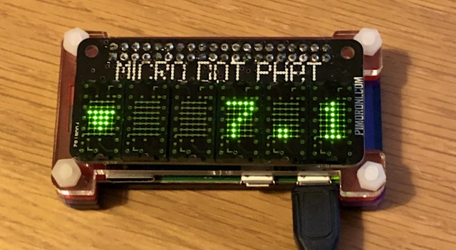
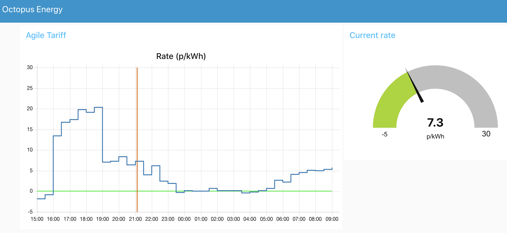

# Octopus Agile Price Display

A simple Node-RED flow and Python script to display the current Octopus Agile
electricity price on a RaspberryPi equipped with a Pimoroni Micro Dot pHAT display:



It also provides a web interface using the Node-RED dashboard:



The main functionality is provided by the Node-RED flow, with the Python script just used to drive the LED display.

The Node-RED flow queries the Octopus Agile tariff API to fetch the half hourly rates once per day and caches the prices in a simple SQLite file based database.

## Install

### Create the empty SQLite database

Create the data basefile file and enter SQLite command prompt:

```bash
sqlite3 agile_rates.sqlite
```

Create the table:

```sql
sqlite> create table rates(start_time unsigned integer primary key, cost unsigned smallint);
```

### Install Node-RED

I recommend installing the latest Node-RED directly from the Node-RED website: [Node-RED Raspberry Pi install guide](https://nodered.org/docs/getting-started/raspberrypi)

### Run

Run Node-RED as a service:

```bash
node-red-start
```

### Configure the node-red flow

Open the Node-RED editor in a browser at `http://<your pi address>:1880` and load the Agile flow using _Menu->Import_.

The current version of the flows has some hardcoded parameters which you may wish to change:
* Path to the SQLite database is by default `/home/pi/agile_rates.sqlite`
* Path to the Python script is by default `/home/pi/display_driver.py`

The energy tariffs are regional, by default the _Get rates_ subflow function _Prepare API_ has its _region_ variable set to region A, which the Eastern Region. The region code is known as the _GSP Group ID_ and can be looked up either via the Octopus API or using the [Wikipedia MPAN Distributor ID table](https://en.wikipedia.org/wiki/Meter_Point_Administration_Number#Distributor_ID)

### Display

The Python script `display_driver.py` is used to drive the [Pimoroni Micro Dot pHAT](https://shop.pimoroni.com/products/microdot-phat?variant=25454635591), I found this is quite a nice readable display that looks clearer in real life than my photo above.

### TODO

* improve the documentation!
* make the key configuration parameters more easily accessible

